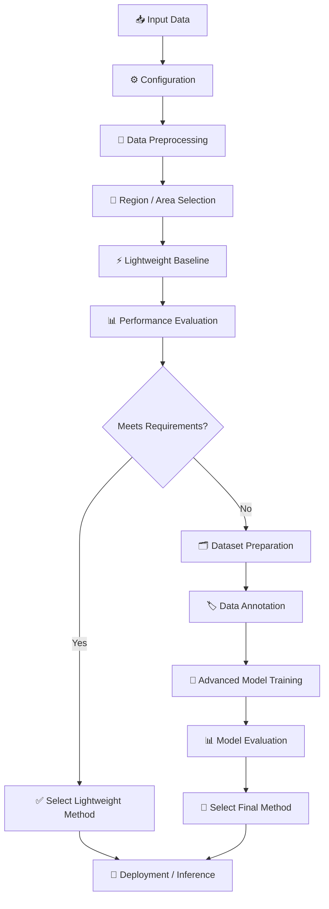
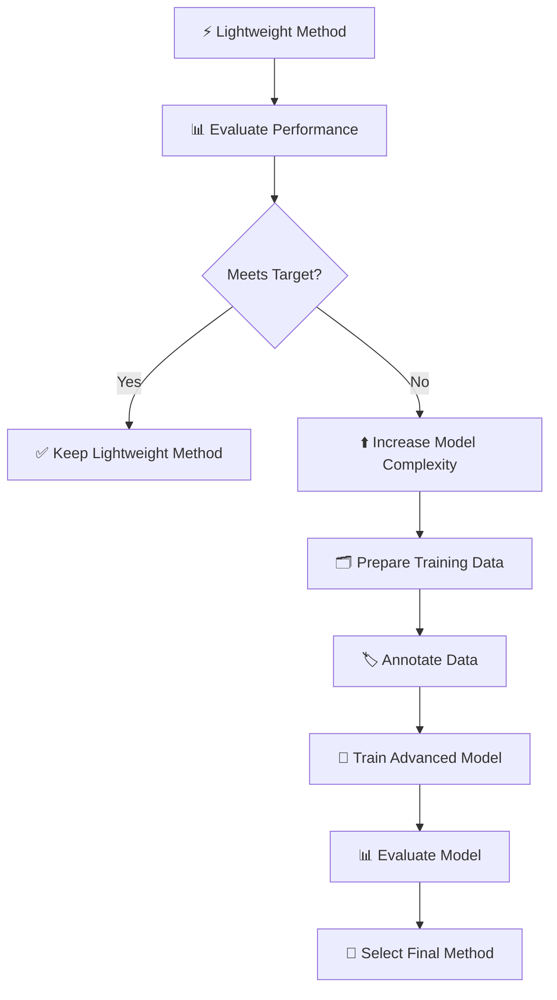

# 🔬 BeyondYOLO — Adaptive Computer Vision R&D

<div align="center">

### How can we achieve high accuracy with the lowest practical computation?

**A progressive computer vision pipeline that starts lightweight and increases model complexity only when required**


</div>

---

## 💡 The Idea

Modern object detection models such as YOLO are powerful, but they are not always the most efficient solution for every problem.

Some environments have:

- fixed or predictable camera views,
- known regions of interest,
- repeated visual conditions,
- stable backgrounds,
- limited variation.

In these cases, a lightweight classical computer vision method may already achieve the required performance.

Instead of forcing one method onto every task, this project follows a progressive strategy:

> **Start with the lowest-computation method. Increase model complexity only when the simpler method cannot meet the required performance.**

The goal is not to prove that template matching, CNNs, or YOLO are universally better.

The goal is to select the **most computationally efficient method that can still achieve the target accuracy and reliability**.

---

# 🎯 R&D Objective

The main objective is:

> **Achieve high accuracy while minimizing unnecessary computational cost.**

This creates a trade-off:

```text
Higher Accuracy
      ↑
      │                  Advanced Models
      │                       ▲
      │                       │ Use only when needed
      │              Lightweight Models
      │                       ▲
      │                       │
      │          Classical Computer Vision
      │
      └──────────────────────────────────→ Computational Cost
```

The ideal system is therefore adaptive:

```text
Simple Problem
      ↓
Simple Method
      ↓
If requirements are met → Stop

Difficult Problem
      ↓
Simple Method is insufficient
      ↓
Escalate to a more capable model
```

---

# 🧠 Core Principle

```text
USE THE SIMPLEST METHOD
        ↓
MEASURE PERFORMANCE
        ↓
DOES IT MEET REQUIREMENTS?
        │
   YES  │  NO
        │
        ▼
 DEPLOY METHOD       ESCALATE COMPLEXITY
        │                    ↓
 Low computation     More capable approach
 Fast inference              ↓
                         Re-evaluate
```

The system should not use additional computation unless it provides a meaningful improvement.

---

# 🔄 General Pipeline



In general terms:

```text
INPUT DATA
    ↓
Configuration
    ↓
Preprocessing
    ↓
Region / Area Selection
    ↓
Lightweight Baseline
    ↓
Performance Evaluation
    │
    ├── Meets Requirements
    │       ↓
    │   Use Lightweight Method
    │
    └── Does Not Meet Requirements
            ↓
        Dataset Preparation
            ↓
        Data Annotation
            ↓
        Advanced Model
            ↓
        Evaluation
            ↓
        Final Method Selection
```

---

# ⚡ Stage 1 — Configuration

Configuration separates project settings from processing logic.

Depending on the application, configuration may contain:

- input paths,
- region coordinates,
- processing parameters,
- thresholds,
- templates or reference data,
- model settings,
- evaluation requirements.

Conceptually:

```text
Configuration
     ↓
Processing Rules
     ↓
Reusable Pipeline
```

This allows the same pipeline architecture to be adapted to different datasets and environments without rewriting the entire workflow.

---

# 🎯 Stage 2 — Region / Area Selection

When only a known part of the input is relevant, processing the entire image may be unnecessary.

```text
Full Input
    ↓
Known Relevant Region
    ↓
Process Only Required Area
```

This can reduce:

- image area processed,
- feature computation,
- model input size,
- inference cost.

Region selection can be manual, configuration-based, or discovered during a setup stage.

---

# ⚡ Stage 3 — Lightweight Baseline

The first method should be computationally efficient.

Possible approaches include:

- template matching,
- grayscale analysis,
- edge-based methods,
- gradient-based methods,
- thresholding,
- rule-based logic,
- feature comparison,
- lightweight classical machine learning.

For example:

```text
Region of Interest
        +
Reference / Features
        ↓
Lightweight Processing
        ↓
Score / Prediction
```

The baseline acts as both:

1. an initial solution, and
2. a method-selection test.

If the baseline already performs well enough, additional model complexity may not be justified.

---

# 📊 Stage 4 — Performance Evaluation

A method should not be selected based only on whether it appears to work.

Each candidate method should be evaluated using relevant criteria such as:

- accuracy,
- precision and recall,
- false positives,
- false negatives,
- stability,
- latency,
- FPS,
- CPU usage,
- GPU usage,
- memory usage.

Conceptually:

```text
Candidate Method
       ↓
Performance Evaluation
       ↓
Accuracy + Reliability + Computational Cost
       ↓
Method Selection Decision
```

The exact acceptance threshold depends on the application.

---

# 🔀 Stage 5 — Adaptive Method Selection

This is the central decision stage.



The decision is not:

> Always use the same model.

The decision is:

> Use the lowest-computation method that satisfies the required performance.

For example:

```text
Task A → Lightweight Method → High Accuracy → Keep

Task B → Lightweight Method → High Accuracy → Keep

Task C → Lightweight Method → Insufficient → Advanced Model

Task D → Lightweight Method → Insufficient → Advanced Model
```

Different regions, tasks, or environments can therefore use different final methods.

---

# 🧠 Stage 6 — Advanced Model Pipeline

If the lightweight method does not meet the required performance, the pipeline escalates.

```text
Raw Input
    ↓
Extract Relevant Samples
    ↓
Dataset Preparation
    ↓
Data Annotation
    ↓
Train Advanced Model
    ↓
Validation
    ↓
Performance Evaluation
    ↓
Final Model Selection
```

The advanced stage may use, depending on the problem:

- lightweight CNNs,
- image classifiers,
- object detectors,
- segmentation models,
- other machine learning models.

The specific model is not the core principle.

The core principle is:

> **Increase complexity only when it produces the performance improvement that is actually required.**

---

# ⏱️ Stage 7 — Temporal Stability

For video or sequential data, a single frame may not always represent the correct final state.

Temporary variation can occur because of:

- motion,
- lighting changes,
- noise,
- blur,
- short-term obstruction,
- small visual differences.

Example:

```text
Frame 101 → Positive
Frame 102 → Positive
Frame 103 → Negative  ← temporary variation
Frame 104 → Positive
Frame 105 → Positive
```

A temporal validation layer can reduce unstable decisions:

```text
Frame Predictions
       ↓
Temporal Validation
       ↓
Stable Final Decision
```

This stage is optional and depends on whether the application processes sequential data.

---

# 🚀 Setup vs Runtime

Separating setup from runtime can reduce unnecessary computation.

## 🛠️ Setup

The setup stage may perform more expensive operations:

```text
Input Environment
      ↓
Discover / Define Relevant Areas
      ↓
Prepare References or Data
      ↓
Evaluate Candidate Methods
      ↓
Select Method
      ↓
Save Configuration
```

This stage may use:

- manual configuration,
- object detection,
- model training,
- calibration,
- benchmarking.

## ⚡ Runtime

Runtime uses the method selected during evaluation:

```text
New Input
    ↓
Load Configuration
    ↓
Extract Relevant Region
    ↓
Run Selected Method
    ↓
Validation
    ↓
Final Output
```

The runtime system does not need to repeatedly perform expensive operations that were already completed during setup.

---

# 🧩 Method Hierarchy

A possible progression is:

```text
LEVEL 1
Classical / Rule-Based Methods
        ↓
Lowest computation

        ↓ If insufficient

LEVEL 2
Lightweight Machine Learning
        ↓
Moderate computation

        ↓ If insufficient

LEVEL 3
Neural Network Models
        ↓
Higher capability

        ↓ If required

LEVEL 4
Larger Detection / Vision Models
        ↓
Highest computational cost
```

This hierarchy is not fixed. Different projects may require different methods.

The important idea is progressive escalation.

---

# 📂 Repository Concept

```text
BeyondYOLO/
│
├── config/
│   └── Processing and method settings
│
├── input/
│   └── OWN_INPUT
│
├── preprocessing/
│   └── Input preparation
│
├── roi/
│   └── Region / area processing
│
├── baseline/
│   └── Lightweight classical methods
│
├── evaluation/
│   └── Accuracy and computational analysis
│
├── dataset/
│   └── Dataset preparation
│
├── annotation/
│   └── Labeling workflow
│
├── models/
│   └── Advanced model experiments
│
├── temporal/
│   └── Sequential stability logic
│
├── integration/
│   └── Final method pipeline
│
└── benchmarks/
    └── Performance comparison
```

The actual repository structure may evolve as the R&D develops.

---

# 🔐 About `OWN_INPUT`

The original data used for this R&D is private and is not included in this public repository.

Private inputs are replaced with:

```python
"OWN_INPUT"
```

For example:

```python
input_path = "OWN_INPUT"
```

To run an experiment using your own data:

```python
input_path = "your/input/path"
```

> [!WARNING]
> The repository demonstrates the methodology, experiments, and implementation approach. Original private datasets are intentionally excluded.

---

# 📊 Benchmarking Philosophy

The final method should be compared using both performance and computational cost.

Example benchmark:

| Metric | Lightweight Method | Advanced Model |
| --- | ---: | ---: |
| Accuracy | TBD | TBD |
| Precision | TBD | TBD |
| Recall | TBD | TBD |
| FPS | TBD | TBD |
| CPU Usage | TBD | TBD |
| GPU Usage | TBD | TBD |
| Memory Usage | TBD | TBD |
| Latency | TBD | TBD |

The goal is not automatically to select the method with the highest raw accuracy.

A better decision may be:

```text
Accuracy Difference
        ↓
Is the improvement meaningful?
        ↓
YES → Additional computation may be justified
NO  → Keep the lighter method
```

---

# ⚠️ Important Considerations

A lightweight method may be sufficient when the environment is:

- stable,
- predictable,
- visually consistent,
- limited to known regions.

A more advanced model may be required when there is:

- significant appearance variation,
- changing viewpoints,
- scale changes,
- perspective changes,
- complex backgrounds,
- unpredictable environments,
- insufficient separation using classical methods.

The pipeline is designed to make this decision based on evaluation rather than assumption.

---

# 🔮 Future Work

Possible extensions include:

- [ ] Automatic method recommendation
- [ ] Automatic threshold selection
- [ ] Multi-method benchmarking
- [ ] CPU/GPU performance profiling
- [ ] Adaptive ROI calibration
- [ ] Automated dataset generation
- [ ] Active learning for difficult samples
- [ ] Confidence-based model escalation
- [ ] Lightweight model architecture comparison
- [ ] Hybrid classical CV + neural network pipeline
- [ ] Automatic fallback between methods
- [ ] Deployment benchmarking on edge hardware

---

# 🏁 Conclusion

**BeyondYOLO** explores a broader question than simply replacing one object detector.

> ### What is the minimum computational complexity required to achieve the required accuracy?

The answer may be different for different tasks.

Some problems may be solved by:

```text
Classical Computer Vision
```

Others may require:

```text
Lightweight Neural Networks
```

And more difficult problems may require:

```text
Advanced Vision Models
```

The proposed approach is therefore:

```text
START SIMPLE
    ↓
MEASURE
    ↓
EVALUATE
    ↓
ESCALATE ONLY WHEN NECESSARY
    ↓
DEPLOY THE MOST EFFICIENT VALID METHOD
```

<div align="center">

### 🔬 BeyondYOLO

**High accuracy. Minimal necessary computation.**

</div>
