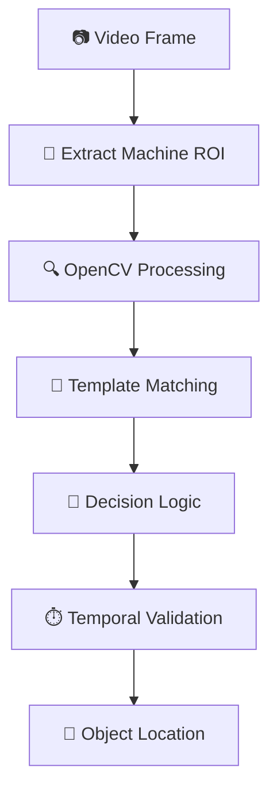
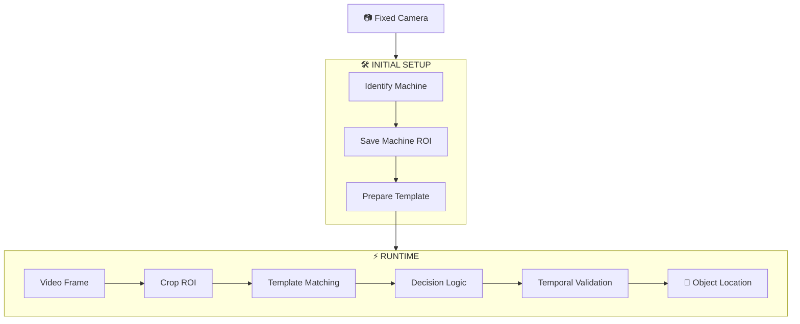
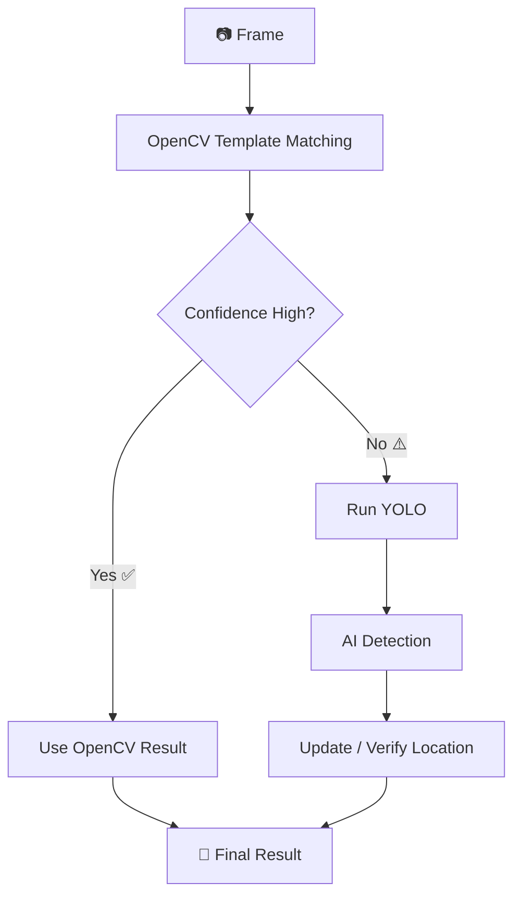

# 🔬 BeyondYOLO — Template Matching R&D

<div align="center">

### Can we avoid running YOLO continuously?

**Exploring OpenCV Template Matching as a lightweight runtime alternative for static environments**


</div>

---

## 💡 The Idea

Object detection models such as **YOLO** are powerful, but do we really need to run an AI model on **every frame** when:

* 📷 the camera is fixed,
* 🏭 the machine is fixed,
* 🎯 the machine ROI is already known,
* 📍 and we only need to determine an object's location?

This R&D explores a simpler approach:

> **Use AI/manual configuration during setup, then use lightweight OpenCV processing during runtime.**

Instead of:

```text
Camera → YOLO → Detection → Object Location
Camera → YOLO → Detection → Object Location
Camera → YOLO → Detection → Object Location
             ↑
      Every single frame
```

the proposed approach is:

```text
Camera
   ↓
Known Machine ROI
   ↓
OpenCV Template Matching
   ↓
Decision Logic
   ↓
Temporal Validation
   ↓
📍 Object Location
```

---

# 🧠 YOLO vs Proposed Approach

|                                    | YOLO Runtime     | OpenCV Runtime      |
| ---------------------------------- | ---------------- | ------------------- |
| AI inference every frame           | ✅                | ❌                   |
| Neural network required at runtime | ✅                | ❌                   |
| Works well with dynamic scenes     | ✅                | ⚠️ Limited          |
| Requires fixed camera              | ❌                | ✅                   |
| Requires known ROI                 | ❌                | ✅                   |
| Runtime approach                   | Deep Learning    | Classical CV        |
| Target of this R&D                 | Baseline concept | ⭐ Proposed approach |

> [!IMPORTANT]
> This project does **not** claim that template matching is universally better than YOLO.
>
> The approach is designed specifically for **controlled environments with a static camera and machine**.

---

# 🎯 R&D Goal

The objective is simple:

> **Find a reliable OpenCV-based method for object location detection without continuously running YOLO during runtime.**

But choosing template matching alone is not enough.

Several questions need to be answered:

```text
Which matching method?
        ↓
Which threshold?
        ↓
How should the score be interpreted?
        ↓
Does a simpler baseline perform similarly?
        ↓
Is the result stable across video frames?
        ↓
Which combination should be used?
        ↓
🏆 FINAL SYSTEM
```

That is what this R&D investigates.

---

# 🧪 R&D Journey

The experiments are divided into **7 stages**.


Each stage answers a different question before the final system is selected.

---

<details>
<summary><b>1️⃣ Ground Truth — What is the correct answer?</b></summary>

<br>

Before comparing different methods, a reference result is required.

Ground truth provides the expected object/location information used to evaluate the experiments.

```text
Input Data
    ↓
Ground Truth
    ↓
Expected Location
```

This becomes the reference against which experimental predictions can be compared.

</details>

---

<details>
<summary><b>2️⃣ Matching R&D — Which matching method works best?</b></summary>

<br>

Different template matching configurations are evaluated.

The experiments investigate factors such as:

* Matching methods
* Templates
* Matching scores
* Thresholds
* ROI configurations

Conceptually:

```text
Machine ROI
     +
 Template
     ↓
┌─────────────────────┐
│ Template Matching   │
└─────────────────────┘
     ↓
 Matching Score
```

The objective is to identify which matching configuration provides the most useful separation between the expected conditions.

</details>

---

<details>
<summary><b>3️⃣ Decision R&D — How should the matching score become a decision?</b></summary>

<br>

Template matching produces a **score**.

But the system ultimately needs a **decision**.

```text
Matching Score
      ↓
   Threshold
      ↓
┌───────────────┐
│ Decision Rule │
└───────────────┘
      ↓
Detected / Not Detected
```

Different decision strategies and thresholds are evaluated to determine how the raw matching results should be interpreted.

</details>

---

<details>
<summary><b>4️⃣ Baseline R&D — Do we actually need the proposed method?</b></summary>

<br>

A method should not be selected simply because it appears to work.

A simpler **baseline** is also evaluated.

```text
               ┌─ Proposed Method ─→ Result
Input ─────────┤
               └─ Baseline Method ─→ Result
```

The comparison helps determine whether the proposed method provides a meaningful advantage over a simpler approach.

</details>

---

<details>
<summary><b>5️⃣ Baseline Decision R&D — Compare at decision level</b></summary>

<br>

Raw scores alone do not represent the final system behavior.

The baseline output is therefore also passed through decision logic.

```text
Proposed Method → Decision Logic → Prediction
                                      ↕
Baseline Method → Decision Logic → Prediction
```

This allows both approaches to be compared based on their actual final decisions.

</details>

---

<details>
<summary><b>6️⃣ Temporal Stability — Is the detection stable?</b></summary>

<br>

Video is not just one image.

A correct system should avoid changing its decision because of one noisy frame.

For example:

```text
Frame 101 → ✅
Frame 102 → ✅
Frame 103 → ❌  ← temporary noise
Frame 104 → ✅
Frame 105 → ✅
```

Without temporal logic:

```text
✅ → ✅ → ❌ → ✅ → ✅
```

With temporal validation:

```text
✅ → ✅ → ✅ → ✅ → ✅
```

Possible causes of temporary instability include:

* Motion
* Lighting variation
* Temporary obstruction
* Image noise
* Small visual differences

The temporal stability stage evaluates the behavior across consecutive frames rather than trusting every frame independently.

</details>

---

<details>
<summary><b>7️⃣ Final Integration — Put everything together</b></summary>

<br>

After the experiments, the selected components are combined into one runtime pipeline.



This becomes the final runtime system.

</details>

---

# ⚙️ Setup vs Runtime

One of the most important ideas in this project is separating **setup** from **runtime**.

### 🛠️ Setup

```text
Camera
  ↓
Identify Machine
  ↓
Define ROI
  ↓
Prepare Template / Reference
  ↓
Save Configuration
```

This stage can involve manual configuration or an object detector if required.

### ⚡ Runtime

Once the machine location is known:

```text
Frame
  ↓
Crop Known ROI
  ↓
OpenCV
  ↓
Decision
  ↓
📍 Object Location
```

No continuous YOLO inference is required.

---

# 🚀 Why?

Imagine a camera monitoring the same machine every day.

If the camera never moves...

and the machine never moves...

then repeatedly asking an AI model:

> *"Where is the machine?"*

may be unnecessary.

We already know where it is.

So instead of searching the entire image:

```text
┌───────────────────────────────────────┐
│                                       │
│             FULL FRAME                │
│                                       │
│         ┌───────────────┐             │
│         │    MACHINE    │             │
│         │      ROI      │             │
│         └───────────────┘             │
│                                       │
└───────────────────────────────────────┘
```

we process only:

```text
┌───────────────┐
│               │
│  MACHINE ROI  │
│               │
└───────────────┘
```

Less area to process + no continuous neural-network inference can result in a lighter runtime pipeline.

> [!NOTE]
> The actual performance improvement should be verified through benchmarking.
>
> Runtime performance depends on hardware, ROI size, template size, image resolution, matching method, and the AI model used for comparison.

---

# 🔄 Complete Concept



---

# 📂 Repository Structure

```text
method_decision-rnd/
│
├── 1. Ground Truth
│      └── Prepare reference results
│
├── 2. Matching R&D
│      └── Test matching methods & thresholds
│
├── 3. Decision R&D
│      └── Evaluate decision logic
│
├── 4. Baseline R&D
│      └── Test baseline approach
│
├── 5. Baseline Decision R&D
│      └── Evaluate baseline decisions
│
├── 6. Temporal Stability
│      └── Test stability across frames
│
└── 7. Final System Integration
       └── Combine selected methods
```

---

# 🔐 About `OWN_INPUT`

The original data used for this R&D is **private** and is therefore not included in this public repository.

Any private input has been replaced with:

```python
"OWN_INPUT"
```

For example:

```python
video_path = "OWN_INPUT"
```

To run the experiment using your own data:

```python
video_path = "your/video/path.mp4"
```

> [!WARNING]
> The repository demonstrates the R&D methodology and implementation.
> The original private images/videos are intentionally excluded.

---

# 📍 Final Output

The final runtime objective is:

<div align="center">

### 📷 Input Frame

↓

### 🎯 Known Machine ROI

↓

### 🔍 OpenCV Processing

↓

### 🧩 Template Matching

↓

### 🧠 Decision + Temporal Logic

↓

# 📍 Object Location

</div>

---

# ⚠️ When Should You NOT Use This?

This approach is not suitable for every environment.

| Situation                 | Recommended               |
| ------------------------- | ------------------------- |
| Fixed camera              | 🟢 Template Matching      |
| Fixed machine             | 🟢 Template Matching      |
| Known ROI                 | 🟢 Template Matching      |
| Controlled environment    | 🟢 Template Matching      |
| Camera frequently moves   | 🔴 YOLO / Object Detector |
| Machine frequently moves  | 🔴 YOLO / Object Detector |
| Large perspective changes | 🔴 YOLO / Object Detector |
| Highly dynamic scene      | 🔴 YOLO / Object Detector |
| Many unknown objects      | 🔴 YOLO / Object Detector |

---

# ⚠️ Known Limitations

### 📷 Camera Movement

Changing the camera position can invalidate the predefined ROI.

### 💡 Lighting

Large lighting changes can affect template matching scores.

### 📐 Scale & Perspective

Traditional template matching is sensitive to significant changes in scale, rotation, and perspective.

### 🚧 Occlusion

Objects blocking the target area can reduce matching reliability.

### 🏭 Machine Movement

If the machine moves, the ROI may need to be recalibrated.

---

# 🧠 Possible Hybrid Approach

The system does not necessarily have to be **OpenCV OR YOLO**.

A future version could use both:



Under normal conditions:

**OpenCV handles the detection.**

When confidence becomes unreliable:

**YOLO acts as a fallback.**

---

# 🔮 Future Work

Possible improvements include:

* [ ] Runtime benchmark: OpenCV vs YOLO
* [ ] CPU usage comparison
* [ ] GPU usage comparison
* [ ] FPS comparison
* [ ] Automatic ROI calibration
* [ ] Adaptive threshold selection
* [ ] Multi-template matching
* [ ] Improved illumination normalization
* [ ] Scale-tolerant matching
* [ ] More robust temporal filtering
* [ ] YOLO fallback mechanism
* [ ] Automatic ROI recovery after camera movement

---

# 📊 Planned Benchmark

A future benchmark can compare:

| Metric             | YOLO | OpenCV |
| ------------------ | ---: | -----: |
| FPS                |  TBD |    TBD |
| CPU Usage          |  TBD |    TBD |
| GPU Usage          |  TBD |    TBD |
| Memory Usage       |  TBD |    TBD |
| Detection Accuracy |  TBD |    TBD |
| Runtime / Frame    |  TBD |    TBD |

This will provide quantitative evidence for the computational trade-offs of the proposed approach.

---

# 🏁 Conclusion

**BeyondYOLO** investigates a simple question:

> ### If we already know where to look, do we need AI to search the entire image every frame?

For a controlled environment with a **fixed camera, fixed machine, and known ROI**, classical computer vision provides another option.

The R&D therefore focuses on finding the best combination of:

**Template Matching → Threshold → Decision Logic → Temporal Stability**

to produce:

> **📍 Reliable Object Location Detection**

without requiring continuous AI inference during normal runtime.

---

<div align="center">

### 🔬 BeyondYOLO

**Use AI where it is needed. Use simpler computer vision where it is enough.**

</div>
